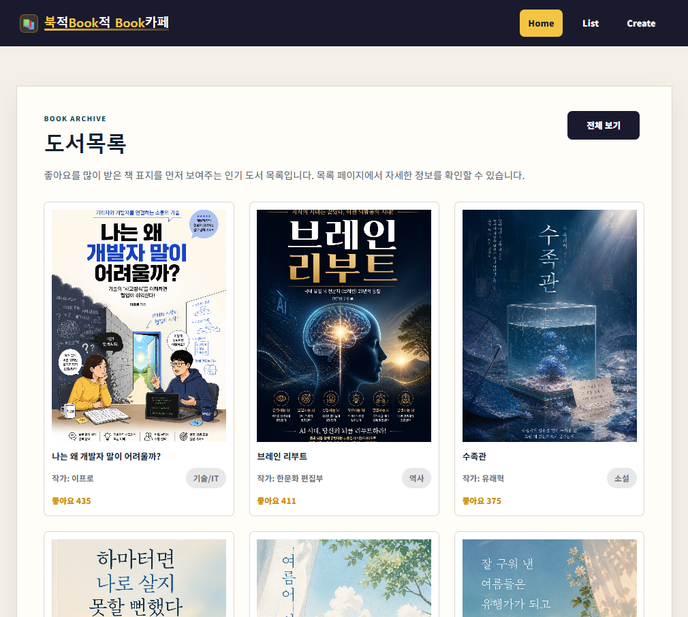
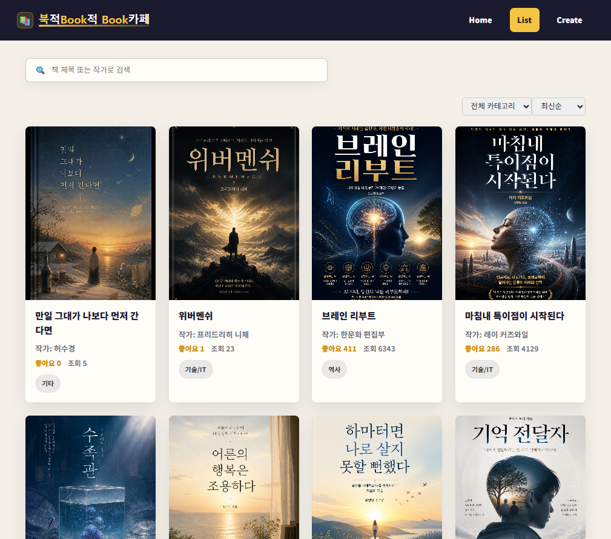
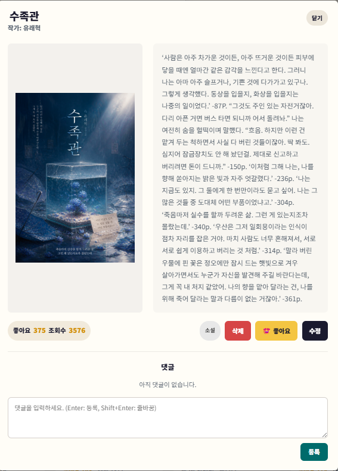
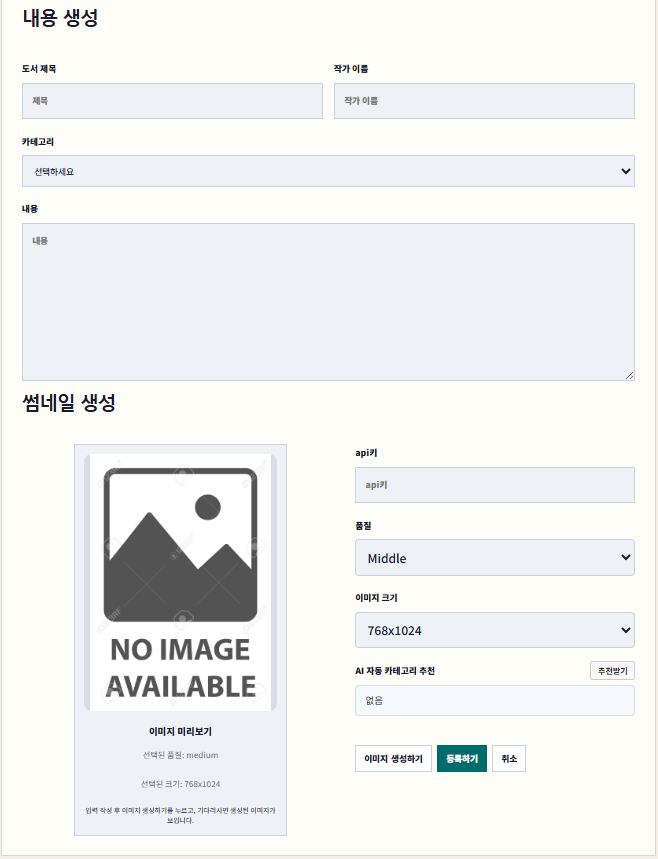
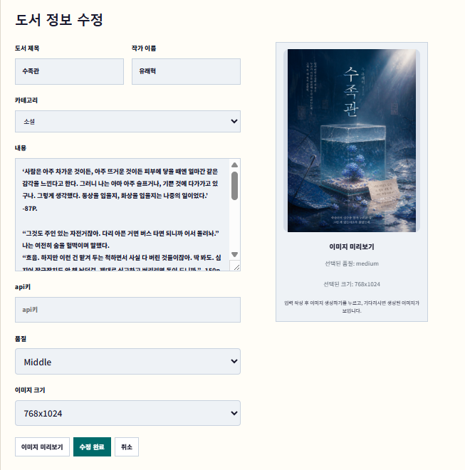
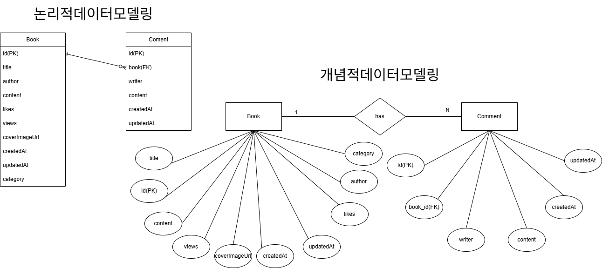

# 북적 Book적 Book카페 - 도서관리 시스템 (Backend)

프론트엔드 React 애플리케이션과 연동하여 데이터의 영속성을 제공하는 Spring Boot 기반의 백엔드 시스템입니다.

도서 및 댓글 데이터의 등록, 목록 조회, 검색, 수정, 삭제(CRUD) 요청을 처리하며, 프론트엔드에서 생성한 Base64 형식의 AI 표지 이미지 데이터를 데이터베이스에 안정적으로 저장하고 제공합니다.

본 프로젝트는 KT AIVLE School AI 트랙 미니프로젝트 5차 과제인  
**도서관리시스템 개발 (백엔드 통합)** 을 기반으로 진행했습니다.

---

# 1. 프로젝트 개요

## 1.1 프로젝트명

**북적 Book적 Book카페 - 도서관리 시스템 (Backend)**

---

## 1.2 프로젝트 목적

기존 `json-server`를 대체하여, 확장 가능하고 안정적인 Spring Boot 기반의 RESTful API 서버를 구축합니다. 프론트엔드 애플리케이션과 연동하여 도서 및 댓글 데이터를 RDBMS에 안전하게 관리하는 것을 목표로 합니다.

---

## 1.3 프로젝트 배경

프론트엔드 실습 환경에서 사용하던 `json-server`는 학습 목적으로는 훌륭하지만, 실제 서비스 환경에서는 데이터의 무결성, 보안, 동시성 처리 등에 한계가 있습니다.

이에 따라 실무에서 널리 사용되는 Java와 Spring Boot 프레임워크를 활용하여 백엔드 서버를 직접 구축하고, H2 데이터베이스(MySQL 모드)와 JPA를 연동하여 실제 서비스와 유사한 데이터 영속성 관리 환경을 구성했습니다.

---

## 1.4 주요 기능

**프론트엔드:**
- 도서 목록 조회 및 검색 (제목/작가)
- 도서 상세보기 모달
- 도서 등록, 수정, 삭제
- 좋아요 및 조회수 기능
- 댓글 조회, 등록, 수정, 삭제
- AI 표지 이미지 생성 (OpenAI)
- 이미지 품질/크기 옵션 선택

**백엔드:**
- RESTful API 제공 (도서, 댓글)
- Spring Data JPA 기반 CRUD
- H2 데이터베이스 (파일 기반)
- 데이터 영속화 및 검색
- 1:N 관계 관리 (도서-댓글)
- 전역 예외 처리
- CORS 설정

---

## 1.5 최종 산출물

| 산출물 | 설명 |
|---|---|
| 프론트엔드 소스코드 | React + Vite 기반 SPA |
| 백엔드 소스코드 | Spring Boot RESTful API 서버 |
| README.md | 프로젝트 개요, 실행 방법 |
| application.yaml | 데이터베이스 및 서버 환경 설정 파일 |
| data/bookdb.mv.db | 파일 기반 H2 데이터베이스 파일 |

---

# 2. 기술 스택

| 구분 | 기술 |
|---|---|
| **Frontend** | |
| UI Framework | React, Vite |
| Routing | React Router DOM |
| HTTP 요청 | Fetch API |
| 스타일링 | CSS |
| **Backend** | |
| Framework | Spring Boot 4.x |
| Language | Java 17 |
| ORM | Spring Data JPA, Hibernate |
| Database | H2 Database (File mode, MySQL 호환) |
| Build Tool | Gradle |
| AI 이미지 생성 | OpenAI Images API |

---

## 2.1 기술 선택 이유

| 기술 | 선택 이유 |
|---|---|
| React | 컴포넌트 기반 UI 구성 및 상태 관리에 적합 |
| Vite | 빠른 개발 서버와 번들링 성능 |
| Spring Boot | 설정의 간소화와 내장 톰캣 제공으로 빠른 REST API 서버 구축 가능 |
| Spring Data JPA | 객체 지향적인 데이터 접근과 반복적인 CRUD 쿼리 작성 최소화 |
| H2 Database | 가볍고 설정이 쉬우며, 파일 모드를 통해 로컬 환경에서도 데이터 영속성 유지 가능 |
| Lombok | Getter, Setter, 생성자 등의 반복 코드를 어노테이션으로 간소화하여 가독성 향상 |

---

# 3. 시스템 구조

```text
React Frontend (Port 5173)
├─ 도서 CRUD 요청
│  └─ Spring Boot Backend (Port 8080)
│     ├─ BookController
│     ├─ BookService
│     └─ BookRepository → H2 Database
│
├─ 댓글 CRUD 요청
│  └─ Spring Boot Backend (Port 8080)
│     ├─ CommentController
│     ├─ CommentService
│     └─ CommentRepository → H2 Database
└─ AI 이미지 생성 요청
   └─ OpenAI Images API
```

---

## 3.1 핵심 구조

- `Controller`: 클라이언트(React)의 HTTP 요청을 받고, 응답을 JSON 형태로 반환합니다. (`BookController`, `CommentController`)
- `Service`: 컨트롤러와 리포지토리 사이에서 비즈니스 로직을 수행하며 트랜잭션을 관리합니다. (`BookService`, `CommentService`)
- `Repository`: `JpaRepository`를 상속받아 데이터베이스의 기본적인 CRUD 메서드를 제공받습니다.
- `Domain (Entity)`: 데이터베이스 테이블과 매핑되는 자바 객체입니다 (`Book.java`, `Comment.java`).

---

## 3.2 핵심 기능별 데이터 흐름

### 도서 데이터 흐름

```text
React Component
  ↓ (GET /api/v1/books)
Spring Boot BookController
  ↓
BookService (비즈니스 로직)
  ↓
BookRepository (JPA)
  ↓
H2 Database
```

### 댓글 데이터 흐름

```text
React Component
  ↓ (GET/POST /api/v1/books/{bookId}/comments)
Spring Boot CommentController
  ↓
CommentService
  ↓
CommentRepository
  ↓
H2 Database (Book_id 외래키로 관계 관리)
```

### AI 이미지 생성 흐름

```text
React (Create/Update화면)
  ↓ (이미지 옵션 + 프롬프트)
OpenAI Images API
  ↓ (b64_json 응답)
React (Data URL 변환)
  ↓ (coverImageUrl 저장)
POST/PATCH /api/v1/books
  ↓
Spring Boot Backend
  ↓
H2 Database (MEDIUMTEXT에 저장)
```

---

# 4. 실행 방법 가이드

## 4.1 개발 환경 요구사항

- **Java 17** 이상 설치 필요
- **Node.js** (프론트엔드 실행용)
- IDE (IntelliJ IDEA, Eclipse 등) 권장

---

## 4.2 백엔드 서버 실행

```bash
# IntelliJ IDEA에서 아래 메인 클래스 실행
java/com/aivle/miniproject5_backend/Miniproject5BackendApplication.java
```

또는 터미널에서 실행:
```bash
./gradlew bootRun
```

백엔드 접속 주소:
```text
http://localhost:8080
```

---

## 4.3 프론트엔드 설정 및 실행

### 패키지 설치

```bash
npm install
```

### 서버 실행

```bash
npm run dev
```

기본 접속 주소:
```text
http://localhost:5173
```

---

## 4.4 H2 데이터베이스 콘솔 접속

브라우저를 통해 내장된 H2 콘솔에 접속하여 직접 데이터를 확인할 수 있습니다.

- **URL**: `http://localhost:8080/h2-console`
- **JDBC URL**: `jdbc:h2:file:./data/bookdb;MODE=MySQL;DATABASE_TO_UPPER=false`
- **User Name**: `sa`
- **Password**: `1234`

---

## 4.5 실행 체크리스트

- [ ] Java 17 설치 확인
- [ ] Node.js 설치 확인 (`node -v`, `npm -v`)
- [ ] `npm install` 완료
- [ ] Spring Boot 백엔드 실행 (포트 8080)
- [ ] `http://localhost:8080/api/v1/books` 접속 가능 확인 (JSON 응답)
- [ ] React 개발 서버 실행 (포트 5173)
- [ ] `http://localhost:5173` 접속 가능 확인
- [ ] H2 콘솔 접속 확인 (선택사항)
- [ ] 도서 등록/조회 기능 테스트
- [ ] 댓글 기능 테스트
- [ ] AI 이미지 생성 테스트 (OpenAI API Key 입력 후)

---

# 5. 주요 화면 (Frontend)

## 5.1 Home 화면
- 서비스 메인 화면
- 인기 도서 표시
- 전체 도서 목록 이동



## 5.2 List 화면
- 도서 목록 표시
- 제목/작가 기준 검색
- 상세보기 모달 표시



## 5.3 상세보기 모달
**표시 정보:**
- 도서 제목, 작가, 카테고리
- 도서 내용
- 표지 이미지
- 좋아요 수, 조회수
- 생성일, 수정일
- 댓글 목록

**제공 기능:**
- 좋아요 증가
- 조회수 증가
- 댓글 작성/수정/삭제
- 도서 수정
- 도서 삭제



## 5.4 Create 화면
**입력 항목:**
- 제목, 작가, 카테고리, 내용, API Key

**AI 기능:**
- 이미지 품질/크기 선택, AI 이미지 생성, 생성 이미지 미리보기

**최종 작업:**
- 도서 등록



## 5.5 Update 화면
- 기존 도서 정보 조회
- AI 표지 재생성
- PATCH 기반 정보 수정
- 수정 완료 후 목록 복귀



---

# 6. API 명세 및 RESTful API 근거

본 백엔드 시스템의 API는 **REST(Representational State Transfer) 아키텍처 스타일**을 준수하여 설계되었습니다.

## 6.1 RESTful 설계 근거

1.  **자원(Resource) 기반의 URI**:
    - 모든 API 엔드포인트는 행위(동사)가 아닌 자원(명사)인 `/api/v1/books`, `/api/v1/books/{bookId}/comments` 등을 기본 경로로 사용합니다.
2.  **HTTP 메서드를 통한 행위 표현**:
    - 리소스에 대한 행위(CRUD)는 URI에 명시하지 않고, HTTP 메서드(GET, POST, PATCH, DELETE)를 통해 명확히 구분합니다.
3.  **적절한 HTTP 상태 코드 반환**:
    - 요청의 결과에 따라 `200 OK`, `201 Created`, `204 No Content`, `404 Not Found` 등 적절한 상태 코드를 반환합니다.
4.  **표현(Representation) 전달**:
    - 클라이언트와 서버 간의 데이터 교환은 JSON 형식을 사용합니다.

## 6.2 주요 엔드포인트 요약

### Book API

```text
Base URL: http://localhost:8080/api/v1/books
```

| 기능 | Method | Endpoint | 설명 |
|---|---|---|---|
| 전체 목록 조회 | GET | `/` | 모든 도서 목록 반환 |
| 단건 도서 조회 | GET | `/{id}` | 특정 ID의 도서 상세 정보 반환 |
| 도서 검색 | GET | `/search?title={keyword}` | 조건(제목, 작가)에 맞는 도서 검색 |
| 도서 등록 | POST | `/` | 새로운 도서 정보 저장 |
| 도서 정보 수정 | PATCH | `/{id}` | 기존 도서의 부분 정보 업데이트 |
| 도서 삭제 | DELETE | `/{id}` | 특정 ID의 도서 삭제 |

### Comment API

```text
Base URL: http://localhost:8080/api/v1/books/{bookId}/comments
```

| 기능 | Method | Endpoint | 설명 |
|---|---|---|---|
| 댓글 목록 조회 | GET | `/` | 특정 도서의 모든 댓글 목록 조회 |
| 댓글 등록 | POST | `/` | 특정 도서에 새로운 댓글 등록 |
| 댓글 수정 | PATCH | `/{commentId}` | 특정 댓글 내용 수정 |
| 댓글 삭제 | DELETE | `/{commentId}` | 특정 댓글 삭제 |

---

# 7. 데이터베이스 스키마 (Entity 구조)

## 7.1 Entity 관계

- **Book : Comment = 1 : N**: 하나의 책은 여러 개의 댓글을 가질 수 있습니다. `Comment` 테이블이 `book_id` 외래 키를 가집니다.

## 7.2 `Book` 엔티티

| 필드 | 타입 | 설명 |
|---|---|---|
| `id` | Long | 도서 고유 ID (자동 생성) |
| `title` | String | 도서 제목 |
| `author` | String | 작가 이름 |
| `category` | String | 도서 카테고리 |
| `content` | String | 도서 내용 (MEDIUMTEXT) |
| `coverImageUrl` | String | 표지 이미지 URL (base64, MEDIUMTEXT) |
| `likes` | Long | 좋아요 수 |
| `views` | Long | 조회수 |
| `createdAt` | DateTime | 생성 일시 |
| `updatedAt` | DateTime | 수정 일시 |

## 7.3 `Comment` 엔티티

| 필드명 | 타입 | 제약 조건 | 설명 |
|---|---|---|---|
| `id` | BIGINT | PK, AUTO_INCREMENT | 댓글 고유 ID |
| `book_id` | BIGINT | FK, NOT NULL | `Book` 테이블 참조 외래 키 |
| `writer` | VARCHAR(50) | NOT NULL | 댓글 작성자 |
| `content` | VARCHAR(1000) | NOT NULL | 댓글 내용 |
| `created_at` | DATETIME | NOT NULL | 등록일시 |
| `updated_at` | DATETIME | | 수정일시 |

## 7.4 ERD 설계



---

# 8. 주요 트러블슈팅 및 고려사항

## 8.1 대용량 Base64 이미지 처리

**이슈**: 프론트엔드에서 생성된 Base64 이미지를 DB에 저장할 때 문자열 길이가 너무 길어 기본 길이를 초과하는 문제 발생.
**해결**: `Book` 엔티티의 `content` 및 `coverImageUrl` 필드에 `@Lob`과 `@Column(columnDefinition = "MEDIUMTEXT")` 매핑을 적용하여 대용량 문자열을 저장할 수 있도록 처리했습니다.

## 8.2 카테고리(Category) 데이터 업데이트 누락

**이슈**: 클라이언트에서 도서 정보 수정 시 카테고리 정보를 전송하지만 DB에 반영되지 않음.
**해결**: `BookService.java`의 `update` 메서드 로직을 수정하여 클라이언트로부터 전달받은 `Category` 데이터가 존재할 경우 기존 엔티티에 병합되도록 업데이트 로직(`existing.setCategory(book.getCategory());`)을 추가했습니다.

---

# 9. 예외 처리 (Exception Handling)

안정적인 API 서비스 제공과 프론트엔드에서의 명확한 에러 핸들링을 위해 전역 예외 처리 메커니즘을 구현했습니다.

## 9.1 전역 예외 처리기 (@RestControllerAdvice)

`GlobalExceptionHandler` 클래스를 통해 컨트롤러 계층에서 발생하는 예외를 한 곳에서 포착하여 일관된 형식의 JSON 응답을 클라이언트에게 반환합니다.

## 9.2 커스텀 예외 클래스

특정 상황에 맞는 예외를 명확히 구분하기 위해 `RuntimeException`을 상속받은 커스텀 예외 클래스들을 정의했습니다.

- **`BookNotFoundException`**: 
  - 발생 상황: 클라이언트가 존재하지 않는 도서 ID로 조회, 수정, 삭제 요청을 보낼 때 발생합니다.
  - 응답: HTTP 상태 코드 `404 Not Found`와 함께 "해당 ID의 도서를 찾을 수 없습니다."라는 메시지를 반환합니다.
- **`CommentNotFoundException`**:
  - 발생 상황: 존재하지 않는 댓글 ID에 대한 작업 요청 시 발생합니다.
  - 응답: HTTP 상태 코드 `404 Not Found` 처리를 담당합니다.

## 9.3 유효성 검사 예외 (@Valid)

- 클라이언트가 잘못된 형식의 데이터(예: 빈 제목, 누락된 작가명)를 전송할 때 발생하는 `MethodArgumentNotValidException`을 처리합니다.
- HTTP 상태 코드 `400 Bad Request`와 함께 어떤 필드에서 검증이 실패했는지 명확한 에러 메시지를 반환하여 프론트엔드 개발자가 쉽게 대응할 수 있도록 돕습니다.
